# SourcingIntel — AI-Powered Supply Chain Intelligence

> All inference runs **on-device** via [Foundry Local](https://aka.ms/foundry-local) (phi-4-mini). No pricing or inventory data leaves the machine.

> **Detailed technical design:** See [TECHNICAL-DESIGN.md](./TECHNICAL-DESIGN.md) for complete architecture, data models, request flows, and module-level documentation.

---

## What It Does

SourcingIntel is a real-time, multi-agent supply chain intelligence platform for retail buyers to assess sourcing exposure, compare supplier-country tradeoffs, and act on supply chain risk. It combines on-device AI inference, live geopolitical data, tariff databases, and a Model Context Protocol (MCP) tool layer into a single decision-support dashboard.

**Key capabilities:**

| Capability | Description |
|---|---|
| **Multi-Agent Chat** | 6 specialist AI agents (Inventory, Tariff, GeoRisk, Dashboard, News, Market) orchestrated by a LangGraph StateGraph |
| **Real-Time Risk Map** | Conflict heatmap updated every 5 minutes from GDELT + US State Dept + BBC/Reuters RSS via SSE |
| **What-If Tariff Simulator** | Slide 0–100% tariff for any country → instant $M annual portfolio impact with AI narrative |
| **Diversification Health** | SRI-risk-adjusted concentration gauge — flags over-reliance on single-country sourcing |
| **Morning Brief with Approvals** | Autonomous agent (7am cron or on-demand) that ranks decisions by urgency, pre-builds chat queries, and lets users Approve/Defer/Dismiss each action |
| **MCP Tool Layer** | 7 MCP stdio servers (35+ tools) + 3 internal MCP clients via InMemoryTransport + runtime tool registry |
| **Convergence Detection** | Detects multi-domain signal overlaps (tariff + conflict + advisory) per country |
| **7-Day Risk Forecasts** | Linear extrapolation of SRI trend history into probability-ranked forecast cards |

---

## Architecture

### High-Level Overview

```
┌─────────────────────────────────────────────────────┐
│  Layer 0: UI (React / Next.js 14 App Router)        │
│  18 components · dark/light theme · SSE live updates │
├─────────────────────────────────────────────────────┤
│  Layer 1: API Routes (Next.js Route Handlers)        │
│  12 endpoints · SSE risk stream · Vercel cron        │
├─────────────────────────────────────────────────────┤
│  Layer 2: Agent Orchestration (LangGraph StateGraph) │
│  Keyword-first intent routing · LLM fallback         │
├─────────────────────────────────────────────────────┤
│  Layer 3: 6 Specialist Agents                        │
│  Inventory · Tariff · GeoRisk · Dashboard · News ·   │
│  Market (MCP tool-calling)                           │
├─────────────────────────────────────────────────────┤
│  Layer 4: MCP Tool Layer (Three-Layer Architecture)  │
│  7 stdio servers · 3 InMemoryTransport clients ·     │
│  Runtime tool registry (oil, FX, BDI, sanctions)     │
├─────────────────────────────────────────────────────┤
│  Layer 5: Storage Adapters (Interface-gated)         │
│  LanceDB (vectors) · SQLite (tariffs/suppliers) ·    │
│  InMemoryRiskStore (SRI + alerts + SSE emitter)      │
├─────────────────────────────────────────────────────┤
│  Layer 6: AI Infrastructure                          │
│  Foundry Local phi-4-mini · Xenova embeddings ·      │
│  Azure AI Foundry (optional cloud fallback)          │
└─────────────────────────────────────────────────────┘
```

### System Architecture Diagram

```mermaid
graph TB
    subgraph UI["UI Layer — Next.js 14 App Router"]
        Chat["ChatInterface\n(natural language queries)"]
        Map["ConflictHeatmap\n(Leaflet.js + deck.gl + SSE)"]
        WI["What-If Simulator\n(tariff impact slider)"]
        DG["Diversification Gauge\n(concentration + SRI)"]
        MB["Morning Brief\n(autonomous daily agent\nwith Decision Queue)"]
        CT["Commodity Ticker\n(live oil/shipping/FX)"]
        RR["RiskRadarStrip\n(top-3 critical countries)"]
        SC["SignalConvergenceStrip\n(multi-domain overlaps)"]
    end

    subgraph API["API Layer — Next.js Route Handlers"]
        Q["/api/query POST"]
        RS["/api/risk-stream GET SSE"]
        WIF["/api/what-if GET"]
        HM["/api/heatmap GET"]
        MBR["/api/morning-brief GET\n(Vercel cron 7am UTC)"]
        DIV["/api/diversification GET"]
        COM["/api/commodities GET"]
        FC["/api/forecasts GET"]
        NP["/api/notify-procurement POST"]
    end

    subgraph Agents["Agent Layer — LangGraph StateGraph"]
        ORC["Orchestrator\nclassify intent → route\n(keyword-first, LLM fallback)"]
        IA["InventoryAgent\nRAG semantic search"]
        TA["TariffAgent\nrate lookup + cost calc"]
        GRA["GeoRiskAgent\nSRI scoring + alerts"]
        DA["DashboardAgent\nmerge all + recommendations"]
        NA["NewsAggregatorAgent\nGDELT + RSS synthesis"]
        MA["MarketIntelAgent\nMCP tool calling"]
    end

    subgraph MCP["MCP Tool Layer (Three-Layer Architecture)"]
        direction TB
        REG["Runtime Registry\nget_oil_price · get_fx_rates\nget_shipping_index · get_sanctions_check\nget_commodity_prices · search_gdelt_news"]
        INT["Internal MCP Clients\n(InMemoryTransport)\nMcpTariffAdapter\nMcpInventoryAdapter\nMcpRiskAdapter"]
        EXT["7 Stdio MCP Servers\n(Claude Desktop compatible)\nrisk · tariff · inventory\ncommodity · sanctions · fx · gdelt"]
    end

    subgraph Storage["Storage Layer"]
        LDB[("LanceDB\n384-dim vectors\n33 SKUs")]
        SQL[("SQLite\ntariffs · suppliers\ncountry_config")]
        MEM[("InMemoryRiskStore\nSRI map · alerts\nEventEmitter → SSE")]
    end

    subgraph AI["AI Infrastructure"]
        FL["Foundry Local\nphi-4-mini\nOn-device · Privacy-first"]
        XT["Xenova Transformers\nall-MiniLM-L6-v2\n384-dim embeddings"]
        CL["Azure AI Foundry\n(optional cloud fallback)"]
    end

    subgraph Data["Live Data Sources (no API keys required)"]
        GD["GDELT"] & RSS["BBC + Reuters RSS"] & SD["US State Dept"]
        STQ["Stooq (oil/BDI)"] & ECB["ECB (FX rates)"] & WB["World Bank WGI"]
    end

    Chat --> Q --> ORC
    Map --> RS
    WI --> WIF
    DG --> DIV
    MB --> MBR
    CT --> COM
    RR --> RS
    SC --> RS

    ORC --> IA & TA & GRA & DA & NA & MA

    MA --> REG
    IA & TA & GRA & DA --> INT
    INT --> LDB & SQL & MEM

    LDB --> XT
    IA & TA & GRA & NA & MA & ORC --> FL
    FL -.->|if AZURE_FOUNDRY_ENDPOINT set| CL

    GD & RSS & SD & WB -->|RiskPoller every 5min| MEM
    STQ --> REG
    ECB --> REG
    MEM -->|riskEmitter| RS
```



---

## Multi-Agent System

The LangGraph StateGraph orchestrates 6 specialist agents with **keyword-first intent classification** (saves 300–2000ms per query by avoiding LLM calls for clear-cut intents, falls back to phi-4-mini for ambiguous queries).

| Agent | Role | Data Sources |
|---|---|---|
| **InventoryAgent** | RAG semantic search + country/price/category routing | LanceDB vectors (via MCP) |
| **TariffAgent** | HS code rate lookup, cost comparison, SKU-switch analysis | SQLite tariffs (via MCP) |
| **GeoRiskAgent** | SRI scoring, signal breakdown, floor rules, alert synthesis | InMemoryRiskStore (via MCP) |
| **DashboardAgent** | Merges inventory + tariff + risk → ranked `SourcingRecommendation[]` | All three stores (via MCP) |
| **NewsAggregatorAgent** | GDELT + RSS conflict signal synthesis with convergence cards | InMemoryRiskStore (via MCP) |
| **MarketIntelAgent** | Live oil, FX, shipping, sanctions via MCP runtime registry | External APIs (via MCP tools) |

**Comparison flow:** `classify → inventoryNode → tariffNode → riskNode → dashboardNode → merged response`

---

## MCP Integration (Three-Layer Architecture)

SourcingIntel implements MCP at three levels, ensuring all agent-tool interactions traverse the MCP protocol:

| Layer | Implementation | Purpose |
|---|---|---|
| **External stdio servers** | 7 servers using `@modelcontextprotocol/sdk` (35+ tools) | Integration with Claude Desktop or any MCP client |
| **Internal MCP clients** | 3 `InMemoryTransport` adapters (`McpTariffAdapter`, `McpInventoryAdapter`, `McpRiskAdapter`) | Agents call storage through MCP protocol at runtime |
| **Runtime tool registry** | `mcpToolRegistry.ts` — pattern-matched tool selection + `Promise.allSettled` execution | MarketIntelAgent calls live financial APIs (oil, FX, BDI, sanctions, GDELT) |

**Standalone MCP servers** (run as separate processes):
```bash
npx tsx src/mcp/riskMcpServer.ts        # SRI scores, alerts, heatmap
npx tsx src/mcp/tariffMcpServer.ts      # compare_countries, calculate_savings
npx tsx src/mcp/inventoryMcpServer.ts   # search_sku, list_by_country
npx tsx src/mcp/commodityMcpServer.ts   # live oil, BDI, cotton, copper
npx tsx src/mcp/sanctionsMcpServer.ts   # OFAC screening
npx tsx src/mcp/fxMcpServer.ts          # live exchange rates
npx tsx src/mcp/gdeltMcpServer.ts       # real-time conflict news
```

---

## Agentic Capabilities — Morning Brief with Approvals

The Morning Brief is a **standalone agentic pipeline** (not routed through the orchestrator) that runs autonomously at 7am UTC (Vercel cron) or on-demand:

1. **Derives** monitored countries from inventory (no hardcoding)
2. **Fetches** SRI scores + tariff comparisons in parallel for all sourcing countries
3. **Builds** a Decision Queue ranked by urgency score: `urgencyScore = risk × financial impact`
4. **Pre-builds** the exact chat query for each decision (ready to auto-submit)
5. **Diffs** against the previous brief to surface what changed overnight (new alerts, resolved, escalated)
6. **Emails** an HTML brief via nodemailer if SMTP is configured

**User workflow:**
- **Approve** → auto-submits pre-built query to the chat agent + notifies procurement team via email
- **Defer** → moves decision to bottom of queue
- **Dismiss** → removes decision
- **Triage Runner** → batch-executes top 3 pending decisions sequentially through the chat agent

---

## Responsible AI Design

| Principle | Implementation |
|---|---|
| **Privacy — On-device inference** | All LLM calls via Foundry Local (phi-4-mini). Pricing data never sent to any cloud. Embeddings also on-device (Xenova). |
| **Sanctions guardrails** | `/api/what-if` returns HTTP 403 for OFAC-sanctioned countries. `InventoryAgent` emits compliance warnings in LLM context. MCP sanctions tool flags OFAC countries for all agents. |
| **Non-suppressible risk floors** | Active conflict → SRI ≥ 85; US sanctions → ≥ 75; chronic instability → ≥ 55; do-not-travel → ≥ 65. Data-driven from `country_config` table — cannot be overridden by absent news. |
| **Grounded responses** | Every agent embeds live data in the LLM's user turn (not system prompt): `[INVENTORY DATA — use ONLY items listed below]`. Prevents hallucination of unseen values. |
| **Circuit breaker** | All external API calls (GDELT, RSS, State Dept, Stooq, ECB) go through `CircuitBreaker`. After 3 failures → returns cached data. UI stays functional when data sources are down. |
| **Source attribution** | LLM responses grounded on explicit `[INVENTORY DATA]`, `[TARIFF DATA]`, `[LIVE MARKET DATA]` blocks with instructions to use only the provided data. |
| **Full tracing** | Every LLM call tagged with UUID + agent name + timing via `withTracing()` decorator. Spans queryable at `/api/trace/[id]`. |

---

## Guardrails

- **Keyword-first classification** prevents unnecessary LLM calls — only ambiguous queries hit the model
- **Prompt Registry** (`src/prompts/prompts.json`) centralizes all system prompts — no scattered prompt strings
- **Token budget control** — each prompt entry has co-located `max_tokens`; agents limit context to ~2KB
- **LRU cache** (256 entries max) with stale-while-revalidate and in-flight request coalescing — prevents cache stampedes
- **Per-connection SSE cleanup** — `riskEmitter.off()` on disconnect (never `removeAllListeners`)
- **Model TTL** — Foundry Local model pinned for 2 hours via SDK to prevent auto-unload during idle time

---

## Key Innovations

| # | Feature | Description |
|---|---|---|
| 1 | **What-If Tariff Simulator** | Slide 0–100% tariff for any country → instant $M annual portfolio impact with AI narrative |
| 2 | **Diversification Health Score** | Herfindahl-like concentration index, SRI-weighted — China >60% spend triggers red alert |
| 3 | **Morning Brief with Decision Queue** | Autonomous agent: urgency-ranked decisions with Approve/Defer/Dismiss, delta diffing, email notifications |
| 4 | **Three-Layer MCP Architecture** | External stdio servers + internal InMemoryTransport clients + runtime tool registry |
| 5 | **Convergence Detection** | Detects overlapping tariff + conflict + travel advisory signals → convergence cards on map |
| 6 | **Embedding-based Grounding** | Every agent embeds live data in the user turn (not system prompt) — phi-4-mini grounds better this way |

---

## Setup

### Prerequisites

- Node.js 20+
- [Foundry Local](https://aka.ms/foundry-local) installed
- Windows: Visual Studio Build Tools (for `better-sqlite3` native addon)

### 1. Start Foundry Local service and load a model

```bash
# Start Foundry Local background service
foundry service start

# Load/run a local model (use your installed model name)
foundry model run phi-4-mini-instruct-openvino-gpu:2
```

> If your local model has a different name, replace `phi-4-mini-instruct-openvino-gpu:2` with that model name.

### 2. Install dependencies

```bash
cd SourcingIntel
pnpm install
```

### 3. Configure environment

```bash
cp .env.example .env.local
# .env.example must be copied to .env.local for local runs.
# Edit .env.local — minimum required:
# FOUNDRY_LOCAL_ENDPOINT=http://localhost:5273
# FOUNDRY_LOCAL_MODEL=phi-4-mini-instruct-openvino-gpu:2
# LANCEDB_PATH=./data/lancedb
# SQLITE_PATH=./data/sourceiq.db
```

### 4. Seed databases (optional)

```bash
# SQLite — tariff rates, supplier profiles, country config
NODE_OPTIONS="--max-old-space-size=4096" npx tsx data/seed.ts

# LanceDB — inventory embeddings (uses Xenova all-MiniLM-L6-v2, no Foundry needed)
NODE_OPTIONS="--max-old-space-size=4096" npx tsx data/seedLanceDb.ts
```

> Use `tsx` (not `ts-node`) — the embedding pipeline uses ESM-only packages.
>
> This repo includes demo SQLite + LanceDB data so you can run locally without reseeding.

### 5. Run

```bash
NODE_OPTIONS="--max-old-space-size=4096" pnpm dev
# Open http://localhost:3000
```


## Evaluations

```bash
NODE_OPTIONS="--max-old-space-size=4096" npx vitest run --config vitest.config.mjs
```

| Test File | Tests | Coverage |
|---|---|---|
| `riskScorer.test.ts` | 4 | SRI floor rules, trend detection, weight correctness |
| `agents.test.ts` | 6 | Circuit breaker, InventoryAgent grounding, Orchestrator routing |
| `evals.test.ts` | 44 | Intent patterns, tariff accuracy (real SQLite), MCP sanctions, RAG grounding |
| `rag.test.ts` | 14 | InventoryRetriever contract, precision@K evaluation |

All 69 tests run **without** a live Foundry Local instance or LLM — agents are tested by verifying grounding data, not LLM output.

---

## API Routes

| Method | Route | Description |
|---|---|---|
| POST | `/api/query` | Main agent chat endpoint — routes through LangGraph Orchestrator |
| GET | `/api/risk-stream` | **SSE** — real-time SRI score stream (heartbeat + live updates) |
| GET | `/api/heatmap` | SRI scores for all monitored countries |
| GET | `/api/what-if?country=China&rate=40` | Tariff impact simulation + AI narrative (HTTP 403 for sanctioned countries) |
| GET | `/api/diversification` | Supply chain diversification health score + recommendations |
| GET | `/api/morning-brief` | Autonomous briefing agent (also triggered by Vercel cron at 7am UTC) |
| GET | `/api/commodities` | Live WTI, Brent, BDI, cotton, copper prices |
| GET | `/api/forecasts` | 7-day risk forecasts per country |
| GET | `/api/world-brief` | Global situation summary |
| GET | `/api/countries` | All monitored country names + metadata |
| POST | `/api/notify-procurement` | Email procurement team on Decision Queue approval |
| GET | `/api/trace/[id]` | Full call tree spans for a given request ID |
| GET | `/api/debug/lancedb` | Dev-only: raw LanceDB inspection |
| GET | `/api/debug/sqlite` | Dev-only: raw SQLite inspection |

---

## Responsible AI

| Principle | Implementation |
|---|---|
| **Privacy** | All LLM inference via Foundry Local — pricing data never sent to any cloud. Embeddings also on-device (Xenova). |
| **Sanctions guardrails** | `/api/what-if` returns HTTP 403 for OFAC-sanctioned countries; `InventoryAgent` emits compliance warnings; MCP sanctions tool flags OFAC countries for all agents |
| **Risk floor rules** | Active conflict → min SRI 85; sanctions → min 75; chronic instability → min 55; do-not-travel → min 65. Data-driven from `country_config` — cannot be suppressed by absent news. |
| **Source attribution** | Every LLM response grounded on explicit `[INVENTORY DATA]`, `[TARIFF DATA]`, `[LIVE MARKET DATA]` blocks — model cannot hallucinate unseen data |
| **Circuit breaker** | External API failures (GDELT, RSS, State Dept) don't cascade — circuit trips open, returns cached data |
| **Tracing** | Every LLM call tagged with UUID + agent name + timing via `withTracing()` decorator; queryable at `/api/trace/[id]` |
