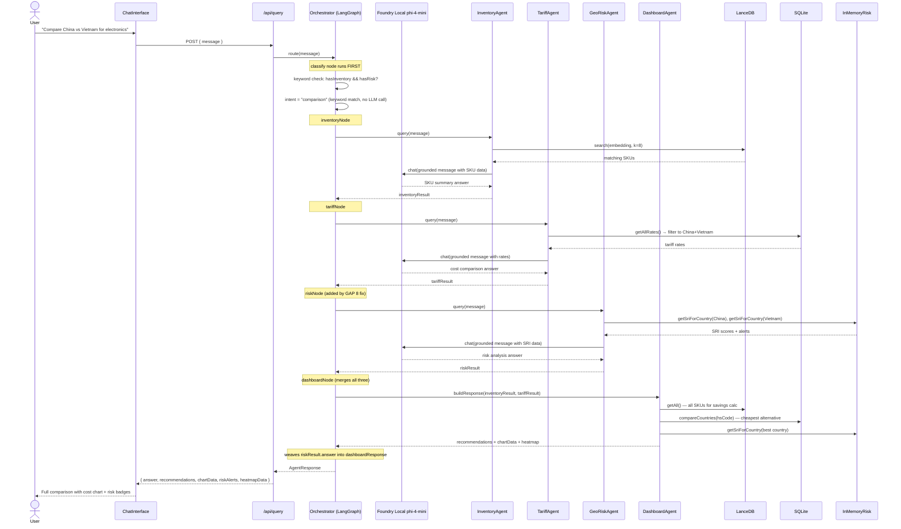
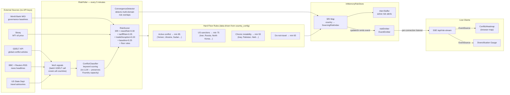
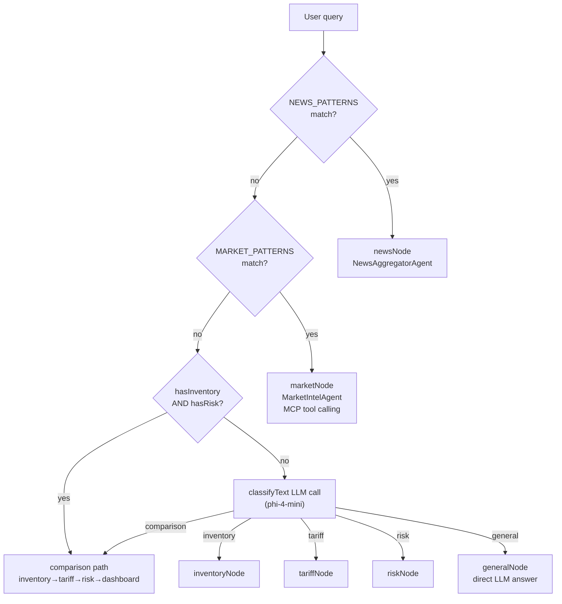

# SourceIQ — AI-Powered Supply Chain Intelligence

> **Microsoft AI Foundry Hackathon submission** — Agentic System Architecture Award track
> All inference runs **on-device** via [Foundry Local](https://aka.ms/foundry-local) (phi-4-mini). No data leaves the machine.

---

## What It Does

SourceIQ is a real-time supply chain intelligence platform that helps retail buyers answer sourcing questions in natural language. It combines local AI inference, live geopolitical data, and tariff databases into a single chat-driven dashboard.

**Key capabilities:**
- Chat with 6 specialist AI agents about inventory, tariffs, geopolitical risk, and market conditions
- Real-time conflict heatmap updated every 5 minutes from GDELT + US State Dept + BBC/Reuters RSS
- What-if tariff simulator (slide 0–100% → see $M annual portfolio impact instantly)
- Supply chain diversification health score (concentration + risk-adjusted)
- Autonomous morning brief agent that runs at 7am and surfaces overnight risk changes

---

## Architecture

### System Overview

```mermaid
graph TB
    subgraph UI["UI Layer — Next.js 14 App Router"]
        Chat["ChatInterface\n(natural language queries)"]
        Map["ConflictHeatmap\n(Leaflet.js + deck.gl + SSE)"]
        WI["What-If Simulator\n(tariff impact slider)"]
        DG["Diversification Gauge\n(concentration + SRI)"]
        MB["Morning Brief\n(autonomous daily agent)"]
        CT["Commodity Ticker\n(live oil/shipping/FX)"]
    end

    subgraph API["API Layer — Next.js Route Handlers"]
        Q["/api/query POST\n(main chat endpoint)"]
        RS["/api/risk-stream GET SSE\n(live SRI updates)"]
        WIF["/api/what-if GET\n(tariff simulation)"]
        HM["/api/heatmap GET\n(risk map data)"]
        MBR["/api/morning-brief GET\n(daily brief + cron)"]
        DIV["/api/diversification GET\n(health score)"]
        COM["/api/commodities GET\n(live market data)"]
    end

    subgraph Agents["Agent Layer — LangGraph StateGraph"]
        ORC["Orchestrator\nclassify intent → route\n(keyword-first, LLM fallback)"]
        IA["InventoryAgent\nRAG semantic search\n+ getByCountry / price sort"]
        TA["TariffAgent\nSQLite rate lookup\n+ cost comparison"]
        GRA["GeoRiskAgent\nSRI scoring + alerts\n+ floor rules"]
        DA["DashboardAgent\nmerge inventory+tariff+risk\n+ savings opportunities"]
        NA["NewsAggregatorAgent\nGDELT + RSS synthesis"]
        MA["MarketIntelAgent\nMCP tool calling\n(oil, FX, shipping, sanctions)"]
    end

    subgraph MCP["MCP Runtime (SDK-backed clients + stdio servers)"]
        GMCP["get_oil_price\nget_shipping_index\nget_commodity_prices"]
        FXMCP["get_fx_rates\n(ECB via frankfurter.app)"]
        SMCP["get_sanctions_check\n(OFAC screening)"]
        NMCP["search_gdelt_news\n(live conflict articles)"]
        TMCP["sourceiq-tariff server\n(compare_countries, calculate_savings)"]
        IMCP["sourceiq-inventory server\n(search_sku, list_by_country)"]
        RMCP["sourceiq-risk server\n(get_heatmap, get_alerts)"]
    end

    subgraph Storage["Storage Layer — Interface-gated adapters"]
        LDB[("LanceDB\n384-dim vectors\n33 SKUs embedded")]
        SQL[("SQLite\n80 tariff rows\n50 supplier rows\ncountry_config table")]
        MEM[("InMemoryRiskStore\nSRI map per country\nactive alerts buffer")]
    end

    subgraph AI["AI Layer"]
        FL["Foundry Local\nphi-4-mini — localhost:5273\nOn-device — Privacy-first"]
        XT["Xenova Transformers\nall-MiniLM-L6-v2\n384-dim embeddings"]
        CL["Azure AI Foundry\n(optional cloud fallback\nif AZURE_FOUNDRY_ENDPOINT set)"]
    end

    subgraph Data["Live Data Sources (no API keys)"]
        GD["GDELT Events API\nglobal conflict signals"]
        RSS["BBC + Reuters RSS\nnews headlines"]
        SD["US State Dept\ntravel advisories"]
        STQ["Stooq\nWTI + Brent crude"]
        ECB["ECB / frankfurter.app\nFX rates"]
    end

    Chat -->|POST message| Q
    Map -->|EventSource| RS
    WI --> WIF
    DG --> DIV
    MB --> MBR
    CT --> COM

    Q --> ORC

    ORC --> IA & TA & GRA & DA & NA & MA

    MA --> GMCP & FXMCP & SMCP & NMCP
    IA --> LDB
    TA --> SQL
    GRA --> MEM
    DA --> LDB & SQL & MEM

    LDB --> XT
    IA & TA & GRA & NA & MA & ORC --> FL
    FL -.->|if env set| CL

    GD & RSS & SD -->|RiskPoller every 5min| MEM
    STQ --> GMCP
    ECB --> FXMCP
    MEM -->|riskEmitter EventEmitter| RS

    TMCP --> SQL
    IMCP --> LDB
    RMCP --> MEM
```



---

### LangGraph Query Flow (Comparison Intent)

The most complex path — triggered by queries like *"Compare sourcing China vs Vietnam for electronics"*.



---

### Real-Time Risk Pipeline



---

### Intent Classification & Routing



---

### Key Design Decisions

| Decision | Choice | Reason |
|---|---|---|
| Orchestration | LangGraph StateGraph | Typed state channels, conditional edges, lazy compilation avoids ESM issues |
| Local AI | Foundry Local phi-4-mini | All pricing data stays on-device — Responsible AI by default |
| Embeddings | Xenova all-MiniLM-L6-v2 | 384-dim, runs in Node.js without GPU, webpackIgnore for SSR |
| Vector search | LanceDB v0.4 | Embedded, zero server, fast cosine similarity |
| Structured data | SQLite better-sqlite3 | 80 tariff + 50 supplier rows, synchronous API, zero setup |
| Classification | Keyword-first, LLM fallback | Saves 300–2000ms per news/market query; LLM only on ambiguous queries |
| Map | Leaflet.js + deck.gl | Leaflet for markers; deck.gl GeoJsonLayer for GPU-accelerated country fill |
| Free data | GDELT + BBC/Reuters + State Dept | No API keys required, covers global conflict signal space |
| MCP | @modelcontextprotocol/sdk | 7 tool servers (in-process registry + 3 stdio servers for external clients) |
| Dependency injection | startup.ts singleton pattern | `riskStore`, `inventoryStore`, `tariffStore` initialized once; all routes import from startup |
| Test isolation | Vitest + mock ICountryConfigStore | `tests/setup.ts` initializes global CountryConfig mock — no SQLite needed in tests |

---

## Innovations

| # | Feature | Description |
|---|---|---|
| 1 | **What-If Tariff Simulator** | Slide 0–100% tariff for any country → instant $M annual portfolio impact with AI narrative |
| 2 | **Diversification Health Score** | SRI-risk-adjusted concentration gauge — China >60% spend triggers red alert |
| 3 | **Morning Brief Agent** | Autonomous 7am cron agent: derives monitored countries from inventory, fetches risk + tariff data in parallel, builds a Decision Queue ranked by urgency score (risk × financial impact), pre-builds the exact chat query for each decision, diffs against the previous brief to surface what changed overnight, and emails an HTML brief if SMTP is configured |
| 4 | **Two-Stage Conflict Classifier** | Keyword scoring (fast, no LLM) + optional LLM fallback for ambiguous signals |
| 5 | **Convergence Detection** | Detects overlapping tariff + conflict + travel advisory signals → convergence cards on map |
| 6 | **Embedding-based Grounding** | Every agent embeds live data in the user turn (not system prompt) — phi-4-mini grounds better this way |

---

## Setup

### Prerequisites

- Node.js 20+
- [Foundry Local](https://aka.ms/foundry-local) installed
- Windows: Visual Studio Build Tools (for `better-sqlite3` native addon)

### 1. Start Foundry Local service and load a model

```bash
# Start Foundry Local background service
foundry service start

# Load/run a local model (use your installed model name)
foundry model run phi-4-mini-instruct-openvino-gpu:2
```

> If your local model has a different name, replace `phi-4-mini-instruct-openvino-gpu:2` with that model name.

### 2. Install dependencies

```bash
cd sourceiq
pnpm install
```

### 3. Configure environment

```bash
cp .env.example .env.local
# .env.example must be copied to .env.local for local runs.
# Edit .env.local — minimum required:
# FOUNDRY_LOCAL_ENDPOINT=http://localhost:5273
# FOUNDRY_LOCAL_MODEL=phi-4-mini-instruct-openvino-gpu:2
# LANCEDB_PATH=./data/lancedb
# SQLITE_PATH=./data/sourceiq.db
```

### 4. Seed databases (optional)

```bash
# SQLite — tariff rates, supplier profiles, country config
NODE_OPTIONS="--max-old-space-size=4096" npx tsx data/seed.ts

# LanceDB — inventory embeddings (uses Xenova all-MiniLM-L6-v2, no Foundry needed)
NODE_OPTIONS="--max-old-space-size=4096" npx tsx data/seedLanceDb.ts
```

> Use `tsx` (not `ts-node`) — the embedding pipeline uses ESM-only packages.
>
> This repo includes demo SQLite + LanceDB data so you can run locally without reseeding.

### 5. Run

```bash
NODE_OPTIONS="--max-old-space-size=4096" pnpm dev
# Open http://localhost:3000
```

---

## Demo Script

Run these queries in order for a complete demo:

| # | Query / Action | Intent | Agent(s) Used |
|---|---|---|---|
| 1 | *"Which electronics do I source from China?"* | inventory | InventoryAgent → LanceDB getByCountry |
| 2 | *"What is the tariff rate for China electronics HS 8471.30?"* | tariff | TariffAgent → SQLite |
| 3 | *"Compare sourcing China vs Vietnam for electronics"* | comparison | All agents → LangGraph full pipeline |
| 4 | *"What is the geopolitical risk for Vietnam right now?"* | risk | GeoRiskAgent → InMemoryRisk + SRI |
| 5 | *"What is the current WTI oil price and shipping index?"* | market | MarketIntelAgent → MCP tools (Stooq + BDI) |
| 6 | *"Summarize today's conflict news"* | news | NewsAggregatorAgent → GDELT + RSS |
| 7 | Open What-If Simulator → drag to 40% China | — | `/api/what-if` → cost simulation |
| 8 | Open Morning Brief (bell icon) | — | `/api/morning-brief` → autonomous agent |

---

## Evaluations

```bash
NODE_OPTIONS="--max-old-space-size=4096" npx vitest run --config vitest.config.mjs
# 69 tests pass across 4 test files:
#   riskScorer.test.ts   — SRI floor rules, trend detection, weight correctness
#   agents.test.ts       — circuit breaker, InventoryAgent grounding, Orchestrator routing
#   evals.test.ts        — tariff accuracy (real SQLite), MCP sanctions, intent patterns, RAG grounding
#   rag.test.ts          — InventoryRetriever contract + precision@K evaluation
```

---

## API Routes

| Method | Route | Description |
|---|---|---|
| POST | `/api/query` | Main agent chat endpoint — routes through LangGraph Orchestrator |
| GET | `/api/risk-stream` | **SSE** — real-time SRI score stream (heartbeat + live updates) |
| GET | `/api/heatmap` | SRI scores for all monitored countries (single fetch for map init) |
| GET | `/api/what-if?country=China&rate=40` | Tariff impact simulation + AI narrative |
| GET | `/api/diversification` | Supply chain diversification health score + recommendations |
| GET | `/api/morning-brief` | Autonomous briefing agent (also triggered by Vercel cron at 7am) |
| GET | `/api/commodities` | Live WTI, Brent, BDI, cotton, copper prices |
| GET | `/api/forecasts` | 7-day risk forecasts per country |
| GET | `/api/world-brief` | Global situation summary |
| GET | `/api/countries` | All monitored country names + metadata |

---

## MCP Servers (Standalone stdio)

Run as separate processes for integration with Claude Desktop or other MCP clients:

```bash
# Risk server — SRI scores, alerts, heatmap data
npx tsx src/mcp/riskMcpServer.ts

# Tariff server — compare_countries, calculate_savings, get_rate
npx tsx src/mcp/tariffMcpServer.ts

# Inventory server — search_sku, list_by_country, get_sku
npx tsx src/mcp/inventoryMcpServer.ts

# Commodity server — live oil, BDI, cotton, copper
npx tsx src/mcp/commodityMcpServer.ts

# Sanctions server — OFAC screening
npx tsx src/mcp/sanctionsMcpServer.ts

# FX server — live exchange rates
npx tsx src/mcp/fxMcpServer.ts

# GDELT server — real-time conflict news search
npx tsx src/mcp/gdeltMcpServer.ts
```

---

## Project Structure

```
sourceiq/
├── app/                            # Next.js App Router
│   ├── page.tsx                    # Dashboard — assembles all components
│   ├── layout.tsx                  # Root layout + font loading
│   ├── globals.css                 # Tailwind base styles
│   ├── api/                        # Server-side route handlers
│   │   ├── query/route.ts          # POST — main chat (→ Orchestrator)
│   │   ├── risk-stream/route.ts    # GET SSE — live risk updates
│   │   ├── heatmap/route.ts        # GET — map initialization data
│   │   ├── what-if/route.ts        # GET — tariff simulation
│   │   ├── diversification/route.ts# GET — health score
│   │   ├── morning-brief/route.ts  # GET — autonomous daily agent
│   │   ├── commodities/route.ts    # GET — live market prices
│   │   ├── forecasts/route.ts      # GET — 7-day risk forecasts
│   │   ├── world-brief/route.ts    # GET — global brief
│   │   └── countries/route.ts      # GET — country metadata
│   └── components/                 # React UI components
│       ├── ChatInterface.tsx        # Main chat panel + streaming display
│       ├── ConflictHeatmap.tsx      # Leaflet.js map (SSR-disabled, dynamic import)
│       ├── WhatIfSimulator.tsx      # Tariff impact slider + cost chart
│       ├── DiversificationGauge.tsx # Circular concentration gauge
│       ├── MorningBrief.tsx         # Daily brief overlay
│       ├── CostComparisonChart.tsx  # Recharts bar chart (current vs recommended)
│       ├── SKUTable.tsx             # Inventory data table
│       ├── CommodityTicker.tsx      # Header ticker (oil, BDI, FX)
│       ├── ConvergenceCards.tsx     # Multi-domain risk overlap cards
│       ├── AIInsightsPanel.tsx      # AI-generated sidebar insights
│       └── LeftPane.tsx            # Left panel — chat + tabs
├── src/
│   ├── adapters/                   # Layer 1 — storage & AI contracts
│   │   ├── interfaces.ts           # IInventoryStore, ITariffStore, IRiskStore, IFoundryClient
│   │   ├── lanceDbInventory.ts     # LanceDB vector adapter (dynamic ESM import)
│   │   ├── sqliteTariff.ts         # SQLite tariff + savings calculator
│   │   ├── sqliteCountryConfig.ts  # SQLite country_config table reader
│   │   ├── inMemoryRisk.ts         # SRI store + EventEmitter for SSE
│   │   ├── foundryLocal.ts         # Foundry Local phi-4-mini adapter
│   │   └── foundryCloud.ts         # Azure AI Foundry cloud adapter (fallback)
│   ├── agents/                     # Layer 2 — LangGraph specialist agents
│   │   ├── orchestrator.ts         # StateGraph — classify → route → merge
│   │   ├── inventoryAgent.ts       # RAG + country/price routing
│   │   ├── tariffAgent.ts          # Rate lookup + cost calculation
│   │   ├── geoRiskAgent.ts         # SRI + alert synthesis
│   │   ├── dashboardAgent.ts       # Merge inventory+tariff+risk+recommendations
│   │   ├── newsAggregatorAgent.ts  # GDELT+RSS signal synthesis
│   │   └── marketIntelAgent.ts     # MCP tool calling (oil, FX, BDI, sanctions)
│   ├── services/                   # Layer 2 — background services
│   │   ├── riskPoller.ts           # 5-minute polling loop (GDELT, RSS, State Dept)
│   │   ├── riskScorer.ts           # SRI formula + floor rules
│   │   ├── conflictClassifier.ts   # Keyword scoring → ConflictSignal severity
│   │   ├── convergenceDetector.ts  # Multi-domain signal overlap detection
│   │   ├── forecastGenerator.ts    # 7-day risk trend projection
│   │   ├── circuitBreaker.ts       # Fault tolerance for external fetches
│   │   ├── riskCache.ts            # TTL cache for World Bank API responses
│   │   └── travelAdvisory.ts       # US State Dept advisory scraper
│   ├── tools/                      # Layer 2 — pure utility functions
│   │   ├── gdeltFetcher.ts         # Batch GDELT fetch (one call covers all countries)
│   │   ├── rssFetcher.ts           # BBC + Reuters RSS with 15min cache
│   │   ├── worldBankBaselines.ts   # Live WGI governance scores (World Bank API)
│   │   ├── commodityFetcher.ts     # WTI, Brent, BDI, cotton, copper (Stooq)
│   │   ├── exchangeRateFetcher.ts  # USD FX rates (ECB via frankfurter.app)
│   │   ├── whatIfSimulator.ts      # Tariff impact calculator (portfolio-level)
│   │   ├── diversificationScore.ts # Herfindahl-like concentration scoring
│   │   ├── costCalculator.ts       # effectiveCost = unitCost × (1 + tariffRate/100)
│   │   └── tariffLookup.ts         # HS code → tariff rate tool definitions
│   ├── mcp/                        # MCP stdio servers (for external clients)
│   │   ├── riskMcpServer.ts        # 5 risk tools (get_sri, get_alerts, get_heatmap…)
│   │   ├── tariffMcpServer.ts      # 5 tariff tools (get_rate, compare_countries…)
│   │   ├── inventoryMcpServer.ts   # 5 inventory tools (search_sku, list_by_country…)
│   │   ├── commodityMcpServer.ts   # Live commodity prices
│   │   ├── sanctionsMcpServer.ts   # OFAC sanctions screening
│   │   ├── fxMcpServer.ts          # Live FX rates
│   │   └── gdeltMcpServer.ts       # GDELT news search
│   ├── rag/                        # RAG pipeline
│   │   ├── ingest.ts               # CSV → Xenova embeddings → LanceDB
│   │   └── retriever.ts            # InventoryRetriever (retrieve + precisionAtK)
│   ├── lib/                        # Shared infrastructure
│   │   ├── startup.ts              # DI root — initializes + exports all singletons
│   │   ├── env.ts                  # Typed env var loader + validation
│   │   ├── foundryLocal.ts         # createFoundryLocalClient() factory
│   │   ├── localEmbeddings.ts      # Xenova embedding wrapper (webpackIgnore)
│   │   ├── mcpToolRegistry.ts      # In-process MCP tool executor + trigger selection
│   │   ├── countryConfig.ts        # Singleton wrapper for ICountryConfigStore
│   │   ├── riskEvents.ts           # Shared EventEmitter (riskEmitter, max 50 listeners)
│   │   └── tracingClient.ts        # withTracing() decorator — UUID + timing per LLM call
│   ├── db/
│   │   ├── schema.sql              # SQLite DDL (tariffs, suppliers, country_config)
│   │   └── sqlite.ts               # createSqliteDb() — opens + auto-runs schema
│   └── types/
│       └── index.ts                # All TypeScript interfaces and enums
├── data/
│   ├── inventory.csv               # 33 demo SKUs (electronics, apparel, home, toys, food)
│   ├── tariffs.json                # 80 tariff rows (10 countries × 8 HS codes + USMCA/FTA)
│   ├── suppliers.json              # 50 supplier profiles
│   ├── conflict-baseline.json      # Fallback baseline risk scores (World Bank WGI proxy)
│   ├── seed.ts                     # Seeds SQLite (tariffs, suppliers, country_config)
│   └── seedLanceDb.ts              # Seeds LanceDB (CSV → Xenova → vectors)
├── tests/
│   ├── setup.ts                    # Vitest global setup — initializes CountryConfig mock
│   ├── riskScorer.test.ts          # SRI floor rules, weight correctness, trend detection
│   ├── agents.test.ts              # CircuitBreaker, InventoryAgent, Orchestrator
│   ├── evals.test.ts               # Intent routing, tariff accuracy, sanctions, grounding
│   └── rag.test.ts                 # InventoryRetriever contract + precision@K evals
├── .env.example                    # Environment variable template
├── next.config.mjs                 # Webpack externals for native .node addons
├── vitest.config.mjs               # Vitest config (setupFiles: tests/setup.ts)
├── vercel.json                     # Vercel cron: morning-brief at 7am daily
└── start.ps1                       # PowerShell: starts Foundry Local + Next.js dev server
```

---

## Responsible AI

| Principle | Implementation |
|---|---|
| **Privacy** | All LLM inference via Foundry Local — pricing data never sent to any cloud |
| **Embeddings on-device** | Xenova all-MiniLM-L6-v2 runs in Node.js process — no external embedding API |
| **Sanctions guardrails** | `/api/what-if` returns HTTP 403 for OFAC-sanctioned countries before running any simulation |
| **Risk floor rules** | Active conflict → min SRI 85; sanctions → min 75; chronic instability → min 55. Cannot be suppressed by absent news signals |
| **Source attribution** | Every LLM response is grounded on explicit `[INVENTORY DATA]`, `[TARIFF DATA]`, or `[LIVE MARKET DATA]` blocks — model cannot hallucinate unseen data |
| **Circuit breaker** | External API failures (GDELT, RSS, State Dept) don't cascade — circuit trips open, returns cached data |
| **Tracing** | Every LLM call tagged with UUID + agent name + timing via `withTracing()` decorator |

---

## Hackathon Alignment

| Award | Alignment |
|---|---|
| **Agentic System Architecture** | LangGraph StateGraph with typed state, conditional edges, 6 specialist agents, circuit breaker, MCP runtime bridge |
| **Azure AI Foundry** | Foundry Local on-device inference; auto-switch to Azure AI Foundry cloud; SDK tracing decorator on every agent |
| **MCP Integration** | 7 MCP stdio servers (35 tools total); in-process registry for runtime tool calling; MarketIntelAgent is fully MCP-tool-driven |
| **Responsible AI** | On-device inference, sanctions guardrails, floor rules, data-grounded responses, source attribution |
| **Free data** | GDELT, BBC/Reuters RSS, US State Dept, World Bank WGI, Stooq, ECB — zero API keys |
